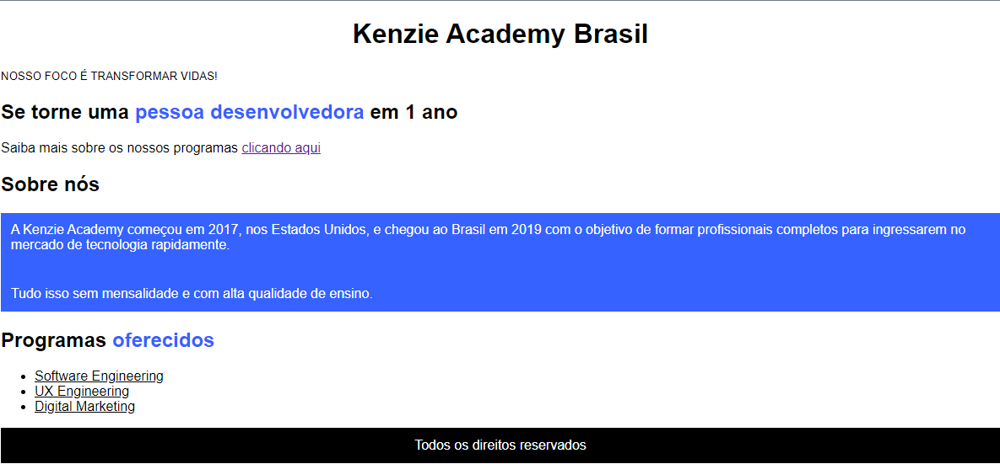

<h1>CSS Selectors Kenzie</h1>

Projeto proposto pela Kenzie Academy para manipular seletores do CSS

    <table style="width: 100%; border:1px solid black; text-align: center;">
        <thead>
            <tr>
                <th>V1</th>
                <th>V2</th>
            </tr>
        </thead>
        <tbody>
            <tr>
                <td>
                    
                </td>
                <td>
                    
                </td>
            </tr>
        </tbody>
        <tfoot style="text-align: center;">
            <tr>
                <td>
                    <h4>Versões</h4>
                </td>
            </tr>
        </tfoot>
    </table>

